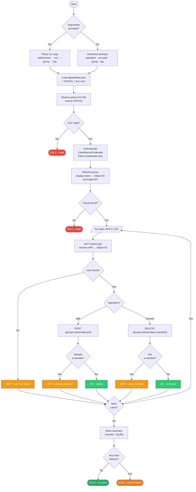
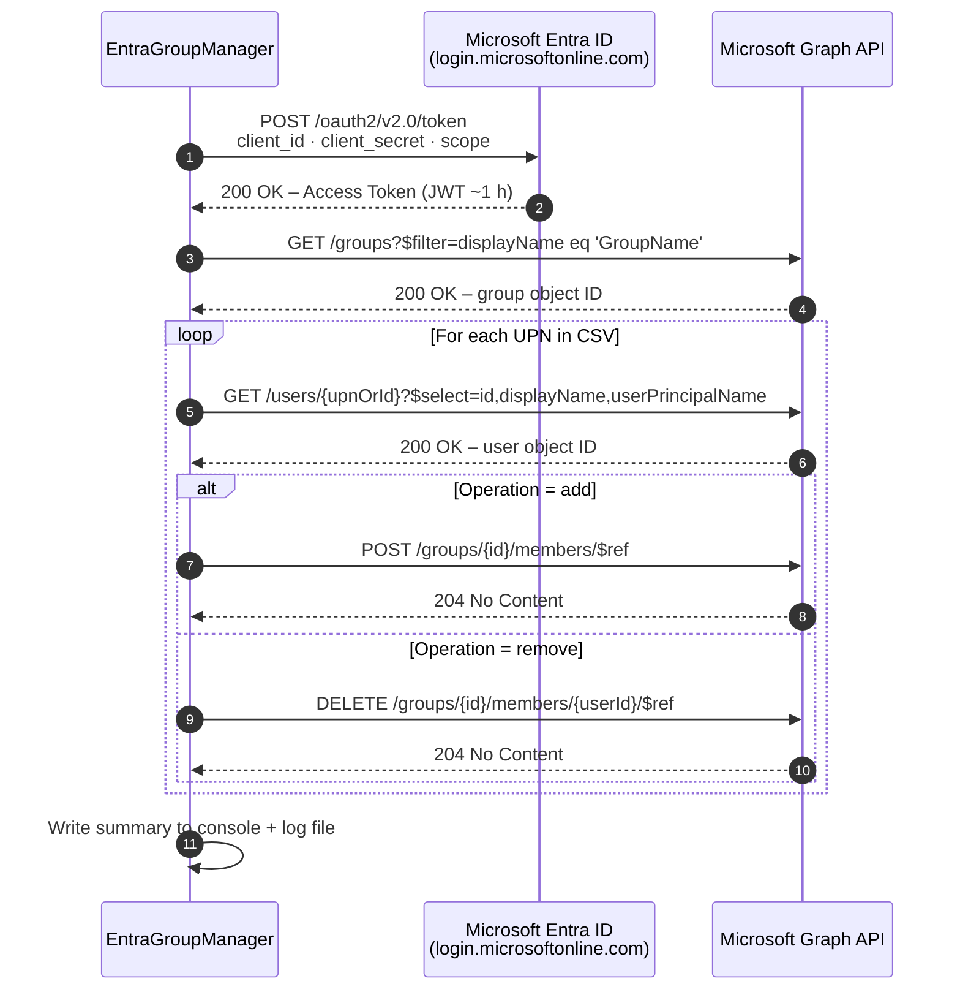
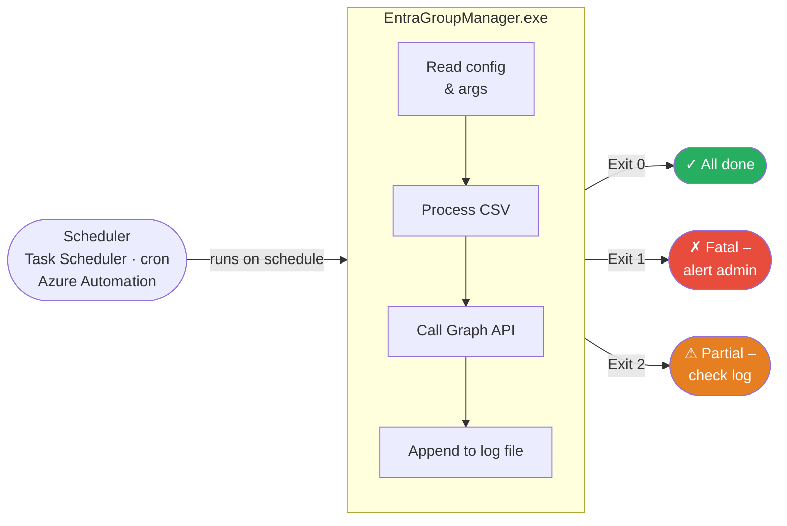

# Entra Security Group – Bulk User Manager

A .NET 8 console application that **adds or removes bulk users** (from a CSV file) to/from a Microsoft Entra ID security group using the **Microsoft Graph API** with the **Client Credentials** OAuth 2.0 flow.

Designed to run interactively **or** fully unattended via Windows Task Scheduler, cron, Azure Automation, or any CI/CD pipeline.

---

## Table of Contents

- [Architecture & Flow](#architecture--flow)
- [Prerequisites](#prerequisites)
- [CSV File Format](#csv-file-format)
- [Step 1 – Register the App in Microsoft Entra ID](#step-1--register-the-app-in-microsoft-entra-id)
- [Step 2 – Configure API Permissions](#step-2--configure-api-permissions)
- [Step 3 – Grant Admin Consent](#step-3--grant-admin-consent)
- [Step 4 – Configure the Application](#step-4--configure-the-application)
- [Step 5 – Build and Run](#step-5--build-and-run)
- [Scheduling the Application](#scheduling-the-application)
- [Exit Codes](#exit-codes)
- [Project Structure](#project-structure)
- [Error Handling](#error-handling)
- [Security Best Practices](#security-best-practices)
- [Troubleshooting](#troubleshooting)

---

## Architecture & Flow

> **View / edit the diagrams live:**
> - [Application Flow →  mermaid.live](https://mermaid.live/edit#pako:eNqVVU1v2zAM_SuCThuQJM7XUgy7FNuGHXYoitsugyFLtC1UlgxLaZsh_32UZNlJ03TYLpZIPj4-UqKfrBCKWcGa1Z5vNAtdUVRpGFa2E2YfqiEi_2aN8G3xAHqxUvUoJYXKOa3K5i9j0hfyRENarv2q2qJVqqVVZVFgIDRALPqtaW0mYdklXqpLKW3zzM0avMtBNKc0hRyFYBnKwpJJiCIcLdgJCiBRlZjkPJBWKLBIwAiGhZqLc6SyHWF2eiHKXbFCQRoT6bFv0R9KFDHBLRUvCYVkyGKyUMPqCiJmjNcbFjjMCxq7LvEMMRJCLBLo8JA6yw1nBoIJCaRfBzawGVNBsVR8p9DqPaYQS8xFpS4M3O3UkBZiYyX0K9K9J3EVv8hYJIHoFSqfwxYZeERNmpPkFzTIIc-DhnnuWQvKjJo5Zu0grUW-5IJRN8p7PBJVDhYKJZZRIcXWI0KJJvl4fEDsmyy_I3WXbsrIJ_5pJbqd1xUJ1j6S3pMjqPUVA7_3U0FHBJdYMJjKRHl6TnxPT3Q4BIl0jDzMxFXXr5JVxKlBRhlOw2NJGjJOGcYWjnFGoREJLJQ4aN4Y5b_JX3c4XYXCflCFe6j-S1aMSSRFZJTFyFCCaxlCIxloqhFLqHIDtOLy0NTy9IlCihHrVVuNJiI4l2M4bI5TuoZvnROX9iFnL0NX_-CK6o)
> - [Scheduling Flow → mermaid.live](https://mermaid.live/edit#pako:eNp1kU9PwzAMxb9K5BNI7UAphx6QJg7bYRL_Log4pKlXIpok1M6GEPvupK27AgcuiZ_t9_yzU3TWEhbYNk3DOXF0jl-XYUN85bqmBp8xB_nEFiRQXEK9LGYeJGXnpC3p4ZIZM7-WkyZiCZETOQhwV8UxEi0-OzIWVvjSbuwepF11AJGWgQ0BtL0jkYjAI1aJt7qHE1Dg7a5PFqKgTasqkH2e5d-M0RcX8HSmYVSj8TJ3cxrjVzOxpMeqBH5IVLmpakYyIjVkLvf3_8A_sPIuOL68VH7DJBBb)

### Application Flow



### OAuth 2.0 Client Credentials Flow



### Scheduling Flow



---

## Prerequisites

| Requirement | Details |
|---|---|
| .NET SDK | 8.0 or later – [Download](https://dotnet.microsoft.com/download) |
| Azure Subscription | With access to Microsoft Entra ID |
| Entra ID Role | **Application Administrator** (or higher) to register apps and grant consent |

---

## CSV File Format

The CSV file must have **one user per row**. The application recognises the following column headers (case-insensitive):

| Accepted header names | Example value |
|---|---|
| `UserPrincipalName` | `john.doe@contoso.com` |
| `UPN` | `john.doe@contoso.com` |
| `Email` | `john.doe@contoso.com` |
| `Mail` | `john.doe@contoso.com` |
| `User` | `john.doe@contoso.com` |

Extra columns are ignored. If no recognised header is found, column 0 is used automatically, so a **headerless single-UPN-per-line file** also works.

### Example CSV files

**With header:**
```csv
UserPrincipalName,Department
alice@contoso.com,Engineering
bob@contoso.com,Finance
charlie@contoso.com,HR
```

**Headerless (one UPN per line):**
```csv
alice@contoso.com
bob@contoso.com
charlie@contoso.com
```

Lines starting with `#` are treated as comments and ignored.

---

## Step 1 – Register the App in Microsoft Entra ID

### Portal Method

1. Sign in to the [Azure Portal](https://portal.azure.com).
2. Navigate to **Microsoft Entra ID** → **App registrations** → **+ New registration**.
3. Fill in the form:
   - **Name**: `EntraGroupManager`
   - **Supported account types**: `Accounts in this organizational directory only`
   - **Redirect URI**: leave blank
4. Click **Register**.
5. On the **Overview** page, note:
   - **Application (client) ID** → `ClientId`
   - **Directory (tenant) ID** → `TenantId`

### Azure CLI Method

```bash
az ad app create --display-name "EntraGroupManager"
az ad sp create --id <AppId>
az account show --query tenantId -o tsv
```

---

## Step 2 – Configure API Permissions

In the app registration, go to **API permissions** → **Add a permission** → **Microsoft Graph** → **Application permissions** and add:

> Full permission reference: [Microsoft Graph permissions reference](https://learn.microsoft.com/en-us/graph/permissions-reference)

| Permission | App Role ID (GUID) | Purpose |
|---|---|---|
| `User.Read.All` | `df021288-bdef-4463-88db-98f22de89214` | Look up users by UPN or object ID |
| `GroupMember.ReadWrite.All` | `dbaae8cf-10b5-4b86-a4a1-f871c94c6695` | Add and remove group members |
| `Group.Read.All` | `5b567255-7703-4780-807c-7be8301ae99b` | Resolve a group display name to its object ID |

The GUIDs above are the **stable app role IDs** for the Microsoft Graph service principal (`00000003-0000-0000-c000-000000000000`) and are identical in every Entra tenant.

### Azure CLI Method

```bash
# User.Read.All  (df021288-bdef-4463-88db-98f22de89214)
az ad app permission add --id <AppId> \
  --api 00000003-0000-0000-c000-000000000000 \
  --api-permissions df021288-bdef-4463-88db-98f22de89214=Role

# GroupMember.ReadWrite.All  (dbaae8cf-10b5-4b86-a4a1-f871c94c6695)
az ad app permission add --id <AppId> \
  --api 00000003-0000-0000-c000-000000000000 \
  --api-permissions dbaae8cf-10b5-4b86-a4a1-f871c94c6695=Role

# Group.Read.All  (5b567255-7703-4780-807c-7be8301ae99b)
az ad app permission add --id <AppId> \
  --api 00000003-0000-0000-c000-000000000000 \
  --api-permissions 5b567255-7703-4780-807c-7be8301ae99b=Role
```

---

## Step 3 – Grant Admin Consent

In the **API permissions** page, click **Grant admin consent for \<your tenant\>** and confirm.

```bash
az ad app permission admin-consent --id <AppId>
```

---

## Step 4 – Configure the Application

Copy `appsettings.example.json` → `appsettings.json` and fill in your values:

```json
{
  "AzureAd": {
    "TenantId":     "xxxxxxxx-xxxx-xxxx-xxxx-xxxxxxxxxxxx",
    "ClientId":     "xxxxxxxx-xxxx-xxxx-xxxx-xxxxxxxxxxxx",
    "ClientSecret": "your-client-secret-value"
  }
}
```

Alternatively, set environment variables (useful in CI/CD or containers):

```bash
# Windows
set ENTRA_AzureAd__TenantId=<value>
set ENTRA_AzureAd__ClientId=<value>
set ENTRA_AzureAd__ClientSecret=<value>

# Linux / macOS
export ENTRA_AzureAd__TenantId=<value>
export ENTRA_AzureAd__ClientId=<value>
export ENTRA_AzureAd__ClientSecret=<value>
```

---

## Step 5 – Build and Run

```bash
dotnet build
dotnet run                          # interactive mode
```

### Interactive mode

Running without arguments prompts for all inputs:

```
=== Entra Security Group – Bulk User Manager ===

Operation [add/remove]: add
CSV file path           : C:\Users\me\users.csv
Security group name/ID  : My-Security-Group
Log file path (optional): C:\logs\entra.log
```

### Non-interactive / command-line mode

```bash
# Add users
dotnet run -- add --csv .\users.csv --group "My-Security-Group" --log .\entra.log

# Remove users
dotnet run -- remove --csv .\users.csv --group "My-Security-Group" --log .\entra.log

# Group object ID is also accepted
dotnet run -- add --csv .\users.csv --group "xxxxxxxx-xxxx-xxxx-xxxx-xxxxxxxxxxxx"
```

After publishing, use the compiled executable directly:

```powershell
EntraGroupManager.exe add --csv .\users.csv --group "My-Security-Group" --log .\entra.log
```

---

## Scheduling the Application

Because the app runs non-interactively with command-line arguments, it integrates with any scheduler.

### Windows Task Scheduler

1. **Publish the app** to a fixed folder:
   ```powershell
   dotnet publish -c Release -r win-x64 --self-contained true -o C:\EntraGroupManager\publish
   ```

2. Open **Task Scheduler** → **Create Task**.

3. **General** tab:
   - Name: `Entra Group Sync`
   - Run whether user is logged on or not
   - Run with highest privileges

4. **Triggers** tab → **New**:
   - Choose your schedule (Daily, Weekly, etc.)

5. **Actions** tab → **New**:
   - **Program/script**: `C:\EntraGroupManager\publish\EntraGroupManager.exe`
   - **Arguments**: `add --csv C:\EntraGroupManager\users.csv --group "My-Security-Group" --log C:\logs\entra.log`
   - **Start in**: `C:\EntraGroupManager\publish`

6. Click **OK**, enter service-account credentials.

### Windows Task Scheduler via PowerShell

```powershell
$action  = New-ScheduledTaskAction `
    -Execute "C:\EntraGroupManager\publish\EntraGroupManager.exe" `
    -Argument 'add --csv C:\EntraGroupManager\users.csv --group "My-Security-Group" --log C:\logs\entra.log' `
    -WorkingDirectory "C:\EntraGroupManager\publish"

$trigger = New-ScheduledTaskTrigger -Daily -At "06:00AM"

$settings = New-ScheduledTaskSettingsSet -ExecutionTimeLimit (New-TimeSpan -Hours 1)

Register-ScheduledTask `
    -TaskName "EntraGroupSync" `
    -Action   $action `
    -Trigger  $trigger `
    -Settings $settings `
    -RunLevel Highest
```

### Linux / macOS cron

```cron
# Add users every weekday at 06:00
0 6 * * 1-5 /opt/entra-group-manager/EntraGroupManager \
    add --csv /opt/entra-group-manager/users.csv \
    --group "My-Security-Group" \
    --log /var/log/entra-group-manager.log
```

### Azure Automation Runbook

1. Deploy the app to an Azure Automation Hybrid Worker or use a PowerShell runbook that calls the executable.
2. Store credentials as **Automation Variables** and pass them via `ENTRA_*` environment variables.

---

## Exit Codes

| Code | Meaning |
|---|---|
| `0` | All users processed successfully (succeeded + skipped). |
| `1` | Fatal error before processing started (bad args, missing CSV, group not found, auth failure). |
| `2` | At least one user encountered a hard failure during processing. |

These exit codes allow schedulers and pipelines to detect and alert on failures.

---

## Project Structure

```
EntraGroupManager/
├── Program.cs              # All application logic
├── appsettings.json        # Runtime config (not committed – add to .gitignore)
├── appsettings.example.json# Template – copy to appsettings.json
├── EntraGroupManager.csproj
└── README.md
```

---

## Error Handling

| Scenario | Behaviour |
|---|---|
| User not found in directory | `[SKIP]` – logged, counted as skipped |
| User already a member (add) | `[SKIP]` – idempotent, no error |
| User not a member (remove) | `[SKIP]` – idempotent, no error |
| Graph API error for a user | `[FAIL]` – logged with error code, processing continues |
| Group not found | Fatal – exits with code 1 |
| Multiple groups with same name | Fatal – exits with code 1 (use object ID to disambiguate) |
| CSV file missing | Fatal – exits with code 1 |
| Auth / config error | Fatal – exits with code 1 |

---

## Security Best Practices

- **Never commit `appsettings.json`** – add it to `.gitignore`.
- **Prefer environment variables or Azure Key Vault** for `ClientSecret` in production.
- **Use a dedicated service principal** (`EntraGroupManager`) with only the three permissions above – avoid over-permissive roles.
- **Rotate the client secret** regularly and update the stored value in your scheduler.
- **Scope the log file permissions** so only the service account can read it (it will contain UPNs).

---

## Troubleshooting

| Problem | Solution |
|---|---|
| `Authorization_RequestDenied` | Admin consent has not been granted for the required permissions. |
| `Request_ResourceNotFound` on user lookup | The UPN does not exist in the tenant; check the CSV values. |
| `No security group named '...' was found` | Verify the group name (case-sensitive) or use the object ID instead. |
| `Multiple groups named '...' exist` | Two groups share the same display name – pass the object ID via `--group`. |
| Empty summary (0 processed) | The CSV has no valid UPN column; check the header row. |
| Exit code 2 from scheduler | At least one user failed; inspect the `--log` file for `[FAIL]` lines. |


A .NET 8 console application that adds a Microsoft Entra ID user to a security group using the **Microsoft Graph API** with the **Client Credentials (application)** OAuth 2.0 flow.

---

## Table of Contents

- [Architecture & Flow](#architecture--flow)
- [Prerequisites](#prerequisites)
- [Step 1 – Register the App in Microsoft Entra ID](#step-1--register-the-app-in-microsoft-entra-id)
- [Step 2 – Configure API Permissions](#step-2--configure-api-permissions)
- [Step 3 – Grant Admin Consent](#step-3--grant-admin-consent)
- [Step 4 – Configure the Application](#step-4--configure-the-application)
- [Step 5 – Build and Run](#step-5--build-and-run)
- [Project Structure](#project-structure)
- [Code Logic Walkthrough](#code-logic-walkthrough)
- [Error Handling](#error-handling)
- [Security Best Practices](#security-best-practices)
- [Troubleshooting](#troubleshooting)

---

## Architecture & Flow

```
┌─────────────────────────────────────────────────────────────────┐
│                     Console Application                         │
│                                                                 │
│  1. Read config  ──►  appsettings.json / env vars               │
│  2. Prompt user  ──►  UPN or Object ID + Group Object ID        │
│  3. Authenticate ──►  Azure.Identity (ClientSecretCredential)   │
│  4. Call Graph   ──►  GET  /users/{upn-or-id}                   │
│                  ──►  POST /groups/{groupId}/members/$ref        │
└─────────────────────────────────────────────────────────────────┘
          │                          │
          ▼                          ▼
   Microsoft Entra ID         Microsoft Graph API
   (issues access token)      (handles directory changes)
```

### OAuth 2.0 Client Credentials Flow

This app uses **application permissions** (no user sign-in required). The flow is:

```
App  ──POST──►  https://login.microsoftonline.com/{tenantId}/oauth2/v2.0/token
               Body: client_id, client_secret, scope=https://graph.microsoft.com/.default
     ◄──────── Access Token (JWT, ~1 hour)

App  ──GET───►  https://graph.microsoft.com/v1.0/users/{upnOrId}
     ◄──────── User object (id, displayName, userPrincipalName)

App  ──POST──►  https://graph.microsoft.com/v1.0/groups/{groupId}/members/$ref
               Body: { "@odata.id": "https://graph.microsoft.com/v1.0/directoryObjects/{userId}" }
     ◄──────── 204 No Content (success)
```

---

## Prerequisites

| Requirement | Details |
|---|---|
| .NET SDK | 8.0 or later – [Download](https://dotnet.microsoft.com/download) |
| Azure Subscription | With access to Microsoft Entra ID |
| Entra ID Role | **Application Administrator** (or higher) to register apps and grant consent |

---

## Step 1 – Register the App in Microsoft Entra ID

### Portal Method

1. Sign in to the [Azure Portal](https://portal.azure.com).
2. Navigate to **Microsoft Entra ID** → **App registrations** → **+ New registration**.
3. Fill in the form:
   - **Name**: `EntraGroupManager` (or any descriptive name)
   - **Supported account types**: `Accounts in this organizational directory only`
   - **Redirect URI**: leave blank (not needed for daemon apps)
4. Click **Register**.
5. On the **Overview** page, note down:
   - **Application (client) ID** → this is your `ClientId`
   - **Directory (tenant) ID** → this is your `TenantId`

### Azure CLI Method

```bash
# Create the app registration
az ad app create --display-name "EntraGroupManager"

# Note the appId (ClientId) and the tenant from `az account show`
az ad app list --display-name "EntraGroupManager" --query "[].{AppId:appId}" -o table
az account show --query tenantId -o tsv

# Create a service principal for the app
az ad sp create --id <AppId>
```

---

## Step 2 – Configure API Permissions

The application requires two **Microsoft Graph application permissions**:

| Permission | Type | Purpose |
|---|---|---|
| `User.Read.All` | Application | Look up a user by UPN or Object ID |
| `GroupMember.ReadWrite.All` | Application | Add/remove members in a security group |

> **Why application permissions?**  
> This app runs as a background service with no user signing in. Application permissions allow it to act on behalf of itself using a client secret, without requiring interactive login.

### Portal Method

1. In your app registration, go to **API permissions** → **+ Add a permission**.
2. Select **Microsoft Graph** → **Application permissions**.
3. Search for and select `User.Read.All`, then click **Add permissions**.
4. Repeat and add `GroupMember.ReadWrite.All`.

### Azure CLI Method

```bash
# Get the Microsoft Graph service principal object ID
GRAPH_SP_ID=$(az ad sp show --id 00000003-0000-0000-c000-000000000000 --query id -o tsv)

# Get the app's service principal object ID
APP_SP_ID=$(az ad sp show --id <AppId> --query id -o tsv)

# Add User.Read.All (df021288-bdef-4463-88db-98f22de89214)
# https://learn.microsoft.com/en-us/graph/permissions-reference#userreadall
az ad app permission add \
  --id <AppId> \
  --api 00000003-0000-0000-c000-000000000000 \
  --api-permissions df021288-bdef-4463-88db-98f22de89214=Role

# Add GroupMember.ReadWrite.All (dbaae8cf-10b5-4b86-a4a1-f871c94c6695)
# https://learn.microsoft.com/en-us/graph/permissions-reference#groupmemberreadwriteall
az ad app permission add \
  --id <AppId> \
  --api 00000003-0000-0000-c000-000000000000 \
  --api-permissions dbaae8cf-10b5-4b86-a4a1-f871c94c6695=Role

# Add Group.Read.All (5b567255-7703-4780-807c-7be8301ae99b)
# https://learn.microsoft.com/en-us/graph/permissions-reference#groupreadall
az ad app permission add \
  --id <AppId> \
  --api 00000003-0000-0000-c000-000000000000 \
  --api-permissions 5b567255-7703-4780-807c-7be8301ae99b=Role
```

---

## Step 3 – Grant Admin Consent

Application permissions require **admin consent** before they can be used.

### Portal Method

1. In **API permissions**, click **Grant admin consent for \<your tenant\>**.
2. Confirm by clicking **Yes**.
3. The status columns should now show a green checkmark: ✅ **Granted for \<tenant\>**

### Azure CLI Method

```bash
az ad app permission admin-consent --id <AppId>
```

---

## Step 4 – Configure the Application

### Create a Client Secret

1. In your app registration, go to **Certificates & secrets** → **+ New client secret**.
2. Set a **Description** (e.g., `EntraGroupManager-secret`) and an **Expiry** (recommended: 6 or 12 months).
3. Click **Add**.
4. **Copy the secret Value immediately** — it is only shown once.

#### Azure CLI Method

```bash
az ad app credential reset --id <AppId> --years 1
# Output includes: "password" (the secret), "appId", "tenant"
```

### Set Configuration Values

Edit [appsettings.json](appsettings.json) and replace the placeholders:

```json
{
  "AzureAd": {
    "TenantId":     "xxxxxxxx-xxxx-xxxx-xxxx-xxxxxxxxxxxx",
    "ClientId":     "xxxxxxxx-xxxx-xxxx-xxxx-xxxxxxxxxxxx",
    "ClientSecret": "your-secret-value-here"
  }
}
```

> ⚠️ **Never commit `appsettings.json` with real secrets to source control.**  
> Use environment variables instead (see below).

### Using Environment Variables (Recommended)

Override any config value with an environment variable prefixed `ENTRA_`:

```powershell
# PowerShell
$env:ENTRA_AzureAd__TenantId     = "xxxxxxxx-xxxx-xxxx-xxxx-xxxxxxxxxxxx"
$env:ENTRA_AzureAd__ClientId     = "xxxxxxxx-xxxx-xxxx-xxxx-xxxxxxxxxxxx"
$env:ENTRA_AzureAd__ClientSecret = "your-secret-value"
dotnet run
```

```bash
# bash / zsh
export ENTRA_AzureAd__TenantId="xxxxxxxx-xxxx-xxxx-xxxx-xxxxxxxxxxxx"
export ENTRA_AzureAd__ClientId="xxxxxxxx-xxxx-xxxx-xxxx-xxxxxxxxxxxx"
export ENTRA_AzureAd__ClientSecret="your-secret-value"
dotnet run
```

---

## Step 5 – Build and Run

```powershell
cd C:\EntraGroupManager
dotnet restore
dotnet build
dotnet run
```

### Example Session

```
=== Entra Security Group – Add Member ===

Enter the user UPN or Object ID  : john.doe@contoso.com
Enter the security group Object ID: 11111111-2222-3333-4444-555555555555

Looking up user 'john.doe@contoso.com'...
  Display name : John Doe
  UPN          : john.doe@contoso.com
  Object ID    : aaaaaaaa-bbbb-cccc-dddd-eeeeeeeeeeee

Adding user to group '11111111-2222-3333-4444-555555555555'...

SUCCESS: User has been added to the security group.
```

### Finding the Group Object ID

In the Azure Portal, navigate to:  
**Microsoft Entra ID** → **Groups** → select your group → the **Object ID** is on the **Overview** page.

Or use Azure CLI:

```bash
az ad group show --group "My Security Group" --query id -o tsv
```

---

## Project Structure

```
EntraGroupManager/
├── EntraGroupManager.csproj   # Project file with NuGet dependencies
├── Program.cs                 # Application entry point and core logic
├── appsettings.json           # Configuration file (do NOT commit secrets)
└── README.md                  # This file
```

### NuGet Packages

| Package | Version | Purpose |
|---|---|---|
| `Azure.Identity` | 1.13.2 | `ClientSecretCredential` for OAuth 2.0 token acquisition |
| `Microsoft.Graph` | 5.68.0 | Strongly-typed Microsoft Graph SDK v5 |
| `Microsoft.Extensions.Configuration.Json` | 8.0.1 | `appsettings.json` support |
| `Microsoft.Extensions.Configuration.EnvironmentVariables` | 8.0.0 | Environment variable overrides |

---

## Code Logic Walkthrough

### 1. Configuration Loading

```csharp
IConfiguration config = new ConfigurationBuilder()
    .AddJsonFile("appsettings.json")
    .AddEnvironmentVariables(prefix: "ENTRA_")
    .Build();
```

Environment variables take precedence over `appsettings.json`, so secrets can be injected at runtime without modifying the file.

### 2. Authentication (Client Credentials)

```csharp
var credential = new ClientSecretCredential(tenantId, clientId, clientSecret);
var graphClient = new GraphServiceClient(credential, ["https://graph.microsoft.com/.default"]);
```

`ClientSecretCredential` from `Azure.Identity` handles token acquisition and automatic refresh. The scope `https://graph.microsoft.com/.default` instructs Entra to issue a token with all the application permissions that were admin-consented.

### 3. User Resolution

```csharp
User? user = await graphClient.Users[userInput].GetAsync(req =>
{
    req.QueryParameters.Select = ["id", "displayName", "userPrincipalName"];
});
```

The Graph API accepts both a UPN (e.g., `user@contoso.com`) and a GUID Object ID in the `{userInput}` path segment, making the app flexible.

### 4. Adding Group Membership

```csharp
await graphClient.Groups[groupId].Members.Ref.PostAsync(new ReferenceCreate
{
    OdataId = $"https://graph.microsoft.com/v1.0/directoryObjects/{user.Id}"
});
```

This calls `POST /v1.0/groups/{groupId}/members/$ref`, which is the Graph API endpoint for adding a directory object as a group member. The body is an OData reference pointing to the user's directory object.

---

## Error Handling

| Scenario | Behaviour |
|---|---|
| User already in group | Prints an INFO message; exits cleanly (no error code) |
| User not found | Prints an ERROR message; exits with code 1 |
| Group not found | ODataError from Graph is caught; error code & message displayed |
| Missing configuration | `InvalidOperationException` thrown at startup |
| Graph API errors | `ODataError` caught; code and message printed |
| Unexpected errors | Generic `Exception` caught; message printed |

---

## Security Best Practices

| Practice | Recommendation |
|---|---|
| **Never commit secrets** | Add `appsettings.json` to `.gitignore` or keep only placeholder values |
| **Use short-lived secrets** | Set expiry ≤ 12 months; rotate before expiry |
| **Prefer certificates** | For production, use a certificate instead of a client secret |
| **Use Managed Identity** | If running on Azure (VM, Container App, Function), use `ManagedIdentityCredential` instead |
| **Least privilege** | Only grant `User.Read.All` and `GroupMember.ReadWrite.All`; nothing broader |
| **Audit logs** | Enable Microsoft Entra ID audit logs to track group membership changes |
| **Key Vault** | Store the client secret in Azure Key Vault and reference it at runtime |

### .gitignore Recommendation

Add this to your `.gitignore` to prevent accidental secret leaks:

```gitignore
# Entra config with real secrets
appsettings*.json
!appsettings.example.json
```

---

## Troubleshooting

| Error | Likely Cause | Fix |
|---|---|---|
| `AADSTS700016` – Application not found | Wrong `ClientId` or `TenantId` | Double-check values in Azure Portal → App registrations |
| `AADSTS7000215` – Invalid client secret | Secret expired or incorrect | Regenerate in **Certificates & secrets** |
| `Authorization_RequestDenied` | Admin consent not granted | Re-run Step 3 (grant admin consent) |
| `Request_ResourceNotFound` on user | User does not exist in the tenant | Verify the UPN or Object ID |
| `Request_ResourceNotFound` on group | Wrong group Object ID | Verify the group Object ID in the portal |
| `Request_BadRequest` – One or more added object references already exist | User already in group | Expected; app handles this gracefully |
| `Insufficient privileges` | Wrong permission type (delegated vs application) | Ensure you added **Application** (not Delegated) permissions |
